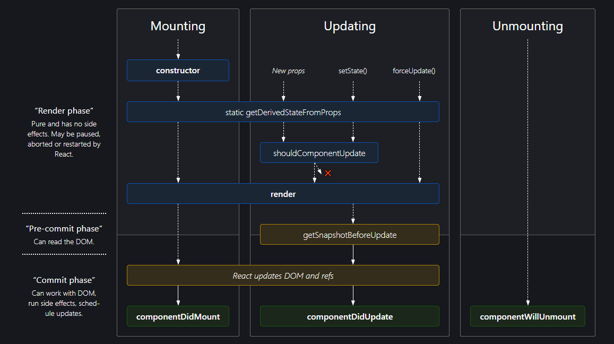

# <mark>DOM</mark>

## What is jsx?

JSX is a syntax extension to JavaScript. It is used with React to describe what the user interface should look like. By using JSX, we can write HTML structures in the same file that contains JavaScript code.

<hr />

## What is dom?

Document Object Modal <br />
Document: Document is the file, say the html file<br />
Object: All the tags inside html file <br />
Modal: A tree like hirerichy structure that javascript creates.<br />

<hr />

## What is virtual dom?

In memory representation or virtual representation or light weight copy of real dom. When our application is rendered first time a first copy of dom is created, when there any update happens a second copy of virtual dom creates and both the copies compare with each other through diffing algorithm (Diffing is a heuristic algorithm), only updated values are sent to the first copy of virtual dom, meanwhile first copy is in the sync of real dom and then from first copy the real dom will be updated. (this process is called reconciliation)

<hr />

## What is diffing algorithm?

When the state of a component changes, React updates the virtual DOM tree. Once the virtual DOM has been updated, React then compares the current version of the virtual DOM with the previous version of the virtual DOM. This process is called “diffing”.

<hr />

## How virtual dom case is faster while still we are actually at the end updating in real dom, so why don't we simply update in real dom rather than creating the whole virtual dom and all the reconciliation procedure?

React follows batch update mechanism to update real dom, which increases perfomance. This means that updates to the real DOM are sent in batches, instead of sending updates for every single change in state. The repainting of the UI is the most expensive part, and React efficiently ensures that the real DOM receives only batched updates to repaint the UI.<br/>
Also react is not responsible for working with real dom that is the job of react dom library, react is a library which has to care about components(props, states, context, etc.).

<hr />

# <mark>Components</mark>

## Component in react?

Component are just chunks of codes that we create for reusing purposes, or we can use them for writting complex logics into small divisions of codes.

<hr />

## Higher order components?

Component that takes a component in the arguments and return a component.

<hr />

## An example for higher order component that you have used in your project?

Layout component

## Pure component?

Based on the concept of purity in functional programming paradigms, a function is said to be pure if it meets the following two conditions:

- Its return value is only determined by its input values
- Its return value is always the same for the same input values

<hr />

## Controlled vs unctrolled components?

**First Answer:**
Controlled: In React, controlled components refer to components that have their state and behavior controlled by the parent component. <br />
Uncontrolled: An uncontrolled functional component is a component that maintains its own internal state. <br />
**Second Answer:**
Controlled: Using states to manage the input
Uncontrolled: Using ref to manage the input

<hr />

## Case: <br />

**I have to create a questions setup form like google form, where we have MCQs type questions, text questions, etc. How will you make the components structure for implementing this kind of thing?**

**Solution:**

1. Sider: Component where we have button to add up questions. <br />
2. Questions: All the questions will be mapped here. <br />
3. Question: Question component. <br />
4. Option: Option component. <br />
5. Index: Main component where we will have questions and sider component called. <br />

<hr />

## What is different between react component, react element and react instance?

- Component are just chunks of codes that we create for reusing purposes, or we can use them for writting complex logics into small divisions of codes.

```
const componentName = () => {
  return (
    <div>Something here</div>
  )
}

export default componentName;
```

- React converts components to elements using createElement function, and that looks like an object which contains information about the component in an object form, which has properties like,

```
$$typeof: Symbol(react.element),
key: null,
props: {children: "Something here"},
ref: null,
type: "div"
```

- React keeps track of its component by creating its instance and each instance has a lifecycle and internal state.

<hr />

# <mark>States and Props</mark>

## What is state?

The state is a built-in React object that is used to contain data or information about the component.

## Why we use state rather than normal javascript variables (var, let, const)?

States are responsible for rendering stuff, by using let, var and const on updation of data component will not render.

<hr />

## Difference between mutable and immutable states?

Immutable: Immutable state means its value cannot be changed once it’s created. <br />
Mutable: Value can be changed <br />

<hr />

## Difference between states and props?

States are mutable while props are immutable. <br />
State is owned locally and the component itself updates it. Props are owned and read-only by a parent

## What is one way data binding? Is two way data binding possible?

Send data from parent to child only.<br />
No 2 way data binding is not possible, we can use global state or states uplifting to solve the problem, but still two way binding is not possible.

<hr />

## How we will share data between different components?

Using props.

<hr />

## Case: <br />

- We have 2 child components
- We have 1 parent components
- Take 2 states in parent component let say a,b
- Pass state a to first child, and b to second child
- Update state a, will second component render or not?
- How to avoid it?
- Using memo avoided the case, now I will pass setA to child 1 and setB to child 2 with the same scenario, will updating of "a" rerender child 2 component?
- How to avoid it?

**Solution:**

1. Yes, on state updating in the parent component all the childs will re-render.<br />
2. We can memoize our components to solve the re-rendering problem, memo is used for this we will make HOC by wrapping our component into memo.<br />
3. By passing, functions as the functions are objects in javascript, so it will create a new reference every time which is why even by using memo it will still cause re-rendering problem, to avoid this we will use useCallback hook.

<hr />

## How we can send data from child to parent or how we can achieve two way binding in react?

Not possible, we can use context hooks or redux for sharing data but still two way binding is not possible.

<hr />

# <mark>React Life Cycles</mark>

[Life Cycle Diagram](https://projects.wojtekmaj.pl/react-lifecycle-methods-diagram/)



## Can you explain lifecycles in react?

We have 3 phases of life cycles in react, mounting, updating and unmounting. <br />

- Mounting: When component loads, componentDidMount calls.
- Updating: When we update any state, componentDidUpdate calls.
- Unmounting: When we have to destroy it, componentWillUnmount calls.

<hr />

## How to achieve lifecycle methods in functional components?

**Mount (componentDidMount)**

```
useEffect(() => {}, [])
```

**Update (componentDidUpdate)**

```
useEffect(() => {}, [dependency])
```

**Unmount (componentWillUnmount)**

```
useEffect(() => {
  return(() => {

  });
}, [])
```

<hr />

## Can you explain mounting, updating and unmounting of components?

- Mounting – Birth of your component
- Update – Growth of your component
- Unmount – Death of your component

<hr />

## What is render method in react?

As the name suggests it handles the rendering of your component to the UI. It happens during the mounting and updating of your component

<hr />

## Is render method a life cycle method?

Yes, it is the most used life cycle method.

<hr />

## When render life cycle runs?

During mounting and update phase.

<hr />

## A render method needs to be pure what does it mean?

It means it has to be pure function whenever you will pass same input it will return same output means you cannot update any states inside render.

<hr />

## When does render method called?

Before component mounted.

<hr />

## When does componentDidMount runs?

After component mounted.

<hr />

## Give a use case for componentDidMount?

To initiate api calls.

<hr />

## When does componentDidUpdatet runs?

After component mounted.

<hr />

## Difference between useEffect and useLayoutEffect?

useEffect runs after component mounted and paint.
useLayoutEffect run before component mounted.

<hr />

## How to unmount component in Functional component?

Using return inside useEffect we can unmound component.

<hr />

## Use case for unmounting?

Sockets, firebase live database, etc. needs to be unsubscribe at some point so we can do that using unmounting.

# <mark>React DOM (react-dom)</mark>

## What is createPortal or what are portals?

It is part of react dom.

It lets you render some children into a different part of the DOM. createPortal(children, domNode). First parameter will be the children could be any kind of jsx element, and second will be the placement location for this jsx could be something like, document.body or document.getElementById("some-id").

```
import { createPortal } from 'react-dom';

<div>
  <p>This child is placed in the parent div.</p>
  {createPortal(
    <p>This child is placed in the document body.</p>,
    document.body
  )}
</div>
```

<hr />

## What is flushSync?

Call flushSync to force React to flush any pending work (effects, pending updates, etc.) and update the DOM synchronously.

```
import { flushSync } from 'react-dom';

flushSync(() => {
  setSomething(123);
});
```

<hr />

## What is findDOMNode?

Call findDOMNode to find the browser DOM node for a given React class component instance.

```
import { findDOMNode } from 'react-dom';

const domNode = findDOMNode(this);
```

## Difference between hydrate and render?

Both are used to render node inside some element.

```
import { hydrate, render } from 'react-dom';

hydrate(<App />, document.getElementById('root'))

render(<App />, document.getElementById('root'))
```

The only difference is, render rerenders the node when there is any update in the dom, but hydrate preserves the node and do not rerenders it on update rather it just attach event handlers.

**Use Case to understand hydrate and render**

I generate the pages and run the server, I go to 127.0.0.1 and am presented with the header hydrate, a button, and two links. I can click the button, but nothing happens. After a few moments, the document finishes loading and the button starts counting my clicks. Then I click on the "render" link. Now, the page I'm presented with has the header render and two links, but no button. After a few moments, the button appears and is immediately responsive.

## What is unmountComponentAtNode?

unmountComponentAtNode removes a mounted React component from the DOM.

## What is createRoot?

createRoot lets you create a root to display React components inside a browser DOM node.

## What is hydrateRoot?

hydrateRoot lets you display React components inside a browser DOM node whose HTML content was previously generated by react-dom/server.

# <mark>Other</mark>

## Why do we need key in react?

When react converts components to elements using createElement it contains a key value pair inside the element object, and that key actually keep tracks of different values when we are dealing with list of childs.

## Why we should prefer a id as unique key instead of index?

Because key should be unique, and it has to be unchangeable if it will change the diffing algorithm will not work properly while comparing virtual doms, so when ever we will add a new element to the list somewhere in between because of using index all the list elements will get disturbed and changed, so diffing algorithm might go for n^3 complexity rather than its normal behavior which is n time complexity, and it will make the scenario slow as well. While we will use id as key, it will not change and diffing algorithm will only deal with entries because all the keys will be associated to ids and even if the new list item inserted in between the ids will still remain same and will disturb the dom.

## What is different between the below codes?

**In code 1 we are creating 2 different components and in second we have created one component and we are handling it for 2 different components using props. So what will be the behavior of react for the below codes?**

**Code 1**

```
<Component1 />

<Component2 />
```

**Code 2**

```
<Component title="first" />

<Component title="second" />

```

**Solution**

- Code 1: React will create a new tree from scratch means new component instances will build for both the components. (slow)

- Code 2: Only attributes will get updated and the component instances will remain same. (fast)

## Do react take care of rendering stuff?

No react just deals with diffing part after that rendering and reconcillation stuff handled by renderers.
